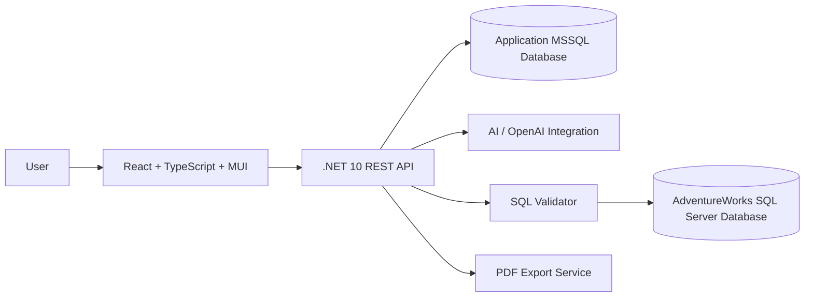
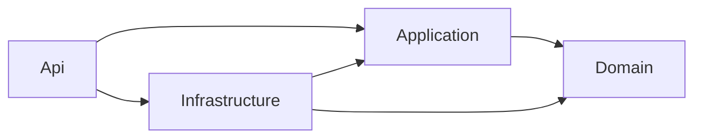

# Architecture

## Purpose

This document describes the initial architecture assumptions for AdventureWorksAIWorkspace.

## High-Level Architecture



## Main Components

### Frontend

Responsible for:

- Main dashboard layout.
- Left report management sidebar.
- Right AI chat sidebar.
- Center report workspace.
- Chart rendering with MUI Charts.
- Report metadata interactions.
- Export actions.

### .NET REST API

Responsible for:

- User authentication and authorization.
- Report persistence.
- AI request orchestration.
- SQL generation workflow.
- SQL validation.
- Query execution.
- Chart configuration generation.
- PDF export orchestration.

## Backend Solution Structure

The backend API solution is organized under:

```txt
source/AdventureWorksAIWorkspaceAPI/src/
  Domain/
  Application/
  Infrastructure/
  Api/
```

The intended dependency direction is:



### Domain Project

Responsible for business concepts that should not depend on infrastructure concerns:

- Entities.
- Value objects.
- Domain events.
- Business rules and invariants.

### Application Project

Responsible for application use cases and CQRS orchestration:

- Commands.
- Queries.
- Command/query handlers.
- Application contracts.
- FluentValidation validators.
- Validation and pipeline behaviors.

Wolverine is the planned in-process mediator for command and query dispatching. Application handlers should remain focused on use cases and avoid direct HTTP concerns. FluentValidation is the planned validation library for command and query input models.

The project exposes `AddApplicationServices` through a static `DependencyInjection` class. Application-owned registrations, such as DTO mapping configuration and Wolverine application assembly configuration, should be configured there.

### Infrastructure Project

Responsible for external implementation details:

- Application database persistence.
- AdventureWorks database access.
- AI/OpenAI integration.
- Export providers.
- File or document generation services.

The project exposes `AddInfrastructureServices` through a static `DependencyInjection` class. Infrastructure-owned registrations, such as future database contexts, external clients, repositories, and provider implementations, should be configured there.

### Api Project

Responsible for the HTTP boundary:

- Wolverine HTTP endpoints.
- REST endpoints or controllers, if a feature needs conventional ASP.NET Core APIs.
- Request/response contracts.
- Authentication and authorization configuration.
- Dependency injection composition.
- API middleware and error handling.
- Development OpenAPI documentation through Swagger UI.

Mapster is the planned DTO mapping library. The Application project owns Mapster mapping configuration, while mapping definitions should be kept close to application DTOs or feature slices. Wolverine handlers should avoid mapper implementations that require service location.

The project exposes `AddApiServices` through a static `DependencyInjection` class. API-owned registrations and middleware composition, such as Serilog, Wolverine HTTP, and endpoint mapping, should be configured there so `Program.cs` remains focused on application startup orchestration.

API exceptions should be handled centrally through ASP.NET Core `IExceptionHandler` and returned as ProblemDetails responses. Application-level `NotFoundException` failures should map to HTTP 404 with a stable RFC 9110 `type`, user-facing `title`, and exception message in `detail`. Unexpected failures should be logged and returned as HTTP 500 without exposing internal exception details.

### Reference Weather Forecast Vertical Slice

The sample `GET /api/weather-forecasts` endpoint is the first reference vertical slice for the backend flow.

The request flow is:

1. Wolverine HTTP receives the request in the Api project.
2. The endpoint sends `GetWeatherForecastsQuery` through Wolverine's message bus.
3. FluentValidation validates the query in the Application project.
4. The Application handler executes the use case.
5. The handler calls the `IWeatherForecastProvider` abstraction.
6. Infrastructure provides the sample implementation.
7. Domain weather forecast values are mapped to application DTOs with Mapster.
8. The API returns the DTO collection to the client.

This endpoint is intentionally sample data only. Its purpose is to validate the CQRS, validation, mapping, dependency injection, Wolverine HTTP, Swagger, and test setup before business features are implemented.

### Application Database

Stores application-owned data:

- Users.
- Reports.
- Report conversations.
- Generated SQL metadata.
- Chart configurations.
- Tags.
- Favorites.
- Export history.

### AdventureWorks Database

Acts as the analytical business data source.

This database should be separate from the application database and accessed through read-only credentials.

### AI Integration

Responsible for:

- Understanding user prompts.
- Generating SQL.
- Suggesting chart types.
- Creating business summaries.
- Supporting follow-up report refinement.

### SQL Validator

Responsible for:

- Blocking destructive SQL.
- Allowing only safe read-only queries.
- Limiting risky SQL patterns.
- Preparing future query safety rules.

## Initial Backend Module Ideas

- Authentication module.
- Reports module.
- Conversations module.
- AI orchestration module.
- SQL generation module.
- SQL validation module.
- Query execution module.
- Visualization planning module.
- Export module.

## Initial Frontend Module Ideas

- App shell layout.
- Report sidebar.
- AI chat sidebar.
- Report workspace.
- Chart renderer.
- Table renderer.
- KPI cards.
- Report metadata controls.
- Export controls.

## Key Architectural Assumptions

- Application data and AdventureWorks data should be stored in separate databases.
- The backend should never expose direct database access to the frontend.
- AI-generated SQL should always pass through validation before execution.
- Reports should store enough metadata to be reopened without regenerating everything.
- SQL query reuse may reduce AI token usage.
