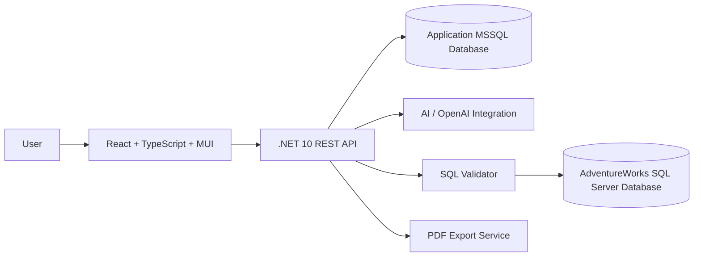
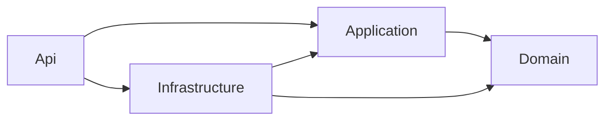
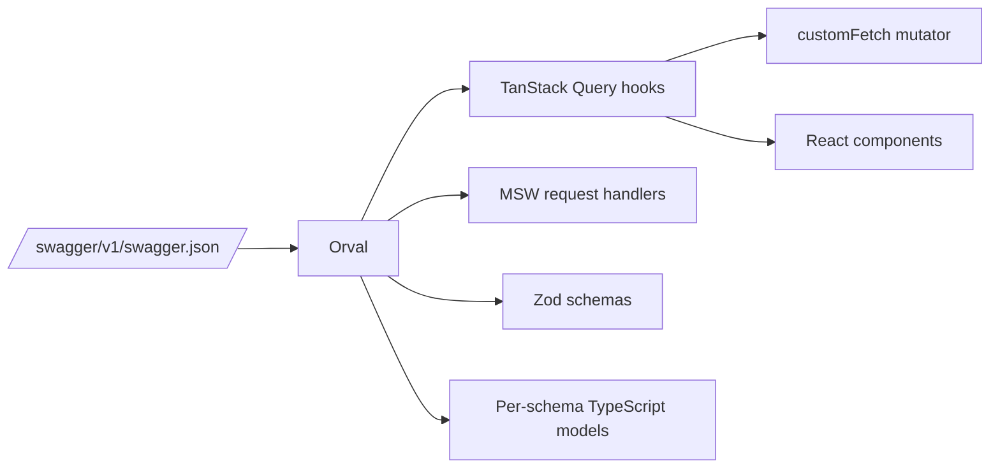

# Architecture

## Purpose

This document describes the initial architecture assumptions for AdventureWorksAIWorkspace.

## High-Level Architecture



## Main Components

### Frontend

Responsible for:

- Main dashboard layout.
- Left report management sidebar.
- Right AI chat sidebar.
- Center report workspace.
- Chart rendering with MUI Charts.
- Report metadata interactions.
- Export actions.
- Transient user feedback through MUI-styled toasts.

The frontend lives under `source/AdventureWorksAIWorkspaceGUI/`. It is bootstrapped with Vite and uses React 19, TypeScript, Material UI 9, MUI Charts, TanStack Query for server state, and sonner for toast notifications. Cypress drives end-to-end and component tests; Vitest drives unit and integration tests through jsdom.

### .NET REST API

Responsible for:

- User authentication and authorization.
- Report persistence.
- AI request orchestration.
- SQL generation workflow.
- SQL validation.
- Query execution.
- Chart configuration generation.
- PDF export orchestration.

## Backend Solution Structure

The backend API solution is organized under:

```txt
source/AdventureWorksAIWorkspaceAPI/src/
  Domain/
  Application/
  Infrastructure/
  Api/
```

The intended dependency direction is:



### Domain Project

Responsible for business concepts that should not depend on infrastructure concerns:

- Entities.
- Value objects.
- Domain events.
- Business rules and invariants.

### Application Project

Responsible for application use cases and CQRS orchestration:

- Commands.
- Queries.
- Command/query handlers.
- Application contracts.
- FluentValidation validators.
- Validation and pipeline behaviors.

Wolverine is the planned in-process mediator for command and query dispatching. Application handlers should remain focused on use cases and avoid direct HTTP concerns. FluentValidation is the planned validation library for command and query input models.

The project exposes `AddApplicationServices` through a static `DependencyInjection` class. Application-owned registrations, such as DTO mapping configuration and Wolverine application assembly configuration, should be configured there.

### Infrastructure Project

Responsible for external implementation details:

- Application database persistence.
- AdventureWorks database access.
- AI/OpenAI integration.
- Export providers.
- File or document generation services.

The project exposes `AddInfrastructureServices` through a static `DependencyInjection` class. Infrastructure-owned registrations, such as future database contexts, external clients, repositories, and provider implementations, should be configured there.

### Api Project

Responsible for the HTTP boundary:

- Wolverine HTTP endpoints.
- REST endpoints or controllers, if a feature needs conventional ASP.NET Core APIs.
- Request/response contracts.
- Authentication and authorization configuration.
- Dependency injection composition.
- API middleware and error handling.
- Development OpenAPI documentation through Swagger UI.

Mapster is the planned DTO mapping library. The Application project owns Mapster mapping configuration, while mapping definitions should be kept close to application DTOs or feature slices. Wolverine handlers should avoid mapper implementations that require service location.

The project exposes `AddApiServices` through a static `DependencyInjection` class. API-owned registrations and middleware composition, such as Serilog, Wolverine HTTP, and endpoint mapping, should be configured there so `Program.cs` remains focused on application startup orchestration.

API exceptions should be handled centrally through ASP.NET Core `IExceptionHandler` and returned as ProblemDetails responses. Application-level `NotFoundException` failures should map to HTTP 404 with a stable RFC 9110 `type`, user-facing `title`, and exception message in `detail`. Unexpected failures should be logged and returned as HTTP 500 without exposing internal exception details.

### Application Database

Stores application-owned data:

- ASP.NET Core Identity users and roles.
- Reports.
- Report conversations.
- Generated SQL metadata.
- Chart configurations.
- Tags.
- Favorites.
- Export history.

Reports are the durable parent record for the chat-driven reporting experience. A report should own its metadata, have one active conversation in the MVP, and have child generated-SQL artifacts for each AI SQL attempt. Chat messages and generated SQL should be stored separately so the user-facing conversation remains readable while the system preserves validation, execution, token, and result metadata for audit and reuse.

### Report Chat API

The persisted report chat API should be report-centered:

- A create-report endpoint receives the first user message, creates the report and conversation, runs the AI SQL workflow, persists the generated SQL attempt, and returns the renderable response.
- A follow-up-message endpoint appends a user message to an existing report conversation, verifies report ownership, builds context from prior messages and SQL artifacts, and persists the assistant response.
- Report read endpoints return metadata for sidebars and full report details for reopening a saved report.

The current generated-report endpoint is useful as a vertical slice for AI SQL generation, SQL validation, and AdventureWorks execution. It should not remain the long-term chat contract unless it also becomes responsible for report ownership, conversation persistence, generated SQL persistence, and report reload behavior.

### AdventureWorks Database

Acts as the analytical business data source.

This database should be separate from the application database and accessed through read-only credentials.

For local development, the root `compose.yaml` runs SQL Server 2025 Developer Edition and a one-shot AdventureWorks initialization container. The init container waits for SQL Server, checks whether the configured AdventureWorks database exists, downloads the official Microsoft sample backup only when needed, and restores it into SQL Server. Docker volumes persist both SQL Server data files and the downloaded backup between runs.

### Data Access Strategy

The backend should use different data access approaches for the two databases because they have different ownership and usage patterns.

Recommended split:

- Use EF Core as the primary ORM for the application database.
- Use a lightweight read-only SQL execution layer for AdventureWorks analytical queries, with Dapper as the preferred MVP option.
- Do not model the full AdventureWorks database as application domain entities unless a future semantic layer requires selected typed projections.
- Do not run EF Core migrations against AdventureWorks.
- Keep application database and AdventureWorks connection strings, credentials, permissions, and configuration options separate.

The application database is owned by AdventureWorksAIWorkspace and should support strongly typed persistence, migrations, relationships, user-specific report storage, tags, favorites, and export metadata.

Authentication-related user and role storage should be handled by ASP.NET Core Identity backed by EF Core in the application database.

AdventureWorks is an external analytical source. The main query path will execute validated AI-generated SQL and return tabular result metadata for dashboard rendering. This makes a full ORM model less useful than a controlled read-only query executor.

All AdventureWorks SQL must pass validation before execution, regardless of the data access library. Query execution should support timeout limits, result-size limits, audit logging, and clear error reporting.

### AI Integration

Responsible for:

- Understanding user prompts.
- Generating SQL.
- Suggesting chart types.
- Creating business summaries.
- Supporting follow-up report refinement.

The AI integration follows the standard abstraction pattern: AI capabilities are defined as Application-owned interfaces, and the concrete client lives in the Infrastructure project.

- The Infrastructure client uses the official `OpenAI` .NET SDK, registered through a typed `HttpClient` so timeouts, resilience policies, and request logging are configured centrally.
- Model configuration is bound through the options pattern (for example, `OpenAiOptions` with `ApiKey`, `Model`, `BaseUrl`, and `TimeoutSeconds`), mirroring `JwtOptions`.
- The API key is never committed to `appsettings.json`; it is supplied through development User Secrets or environment variables, consistent with the Identity bootstrap secret rules.
- Prompt construction, schema context shaping, and workflow orchestration stay in the Application layer. Only transport, serialization, and SDK specifics live in Infrastructure.
- Every model response is treated as untrusted input. Generated SQL must pass the SQL validator before it can be executed against AdventureWorks.

See the technical decision "Use the official OpenAI .NET SDK behind an Application abstraction for AI features" and the backend component mapping in `08-ai-sql-workflow.md`.

### SQL Validator

Responsible for:

- Blocking destructive SQL.
- Allowing only safe read-only queries.
- Limiting risky SQL patterns.
- Preparing future query safety rules.

## Initial Backend Module Ideas

- Authentication module.
- Reports module.
- Conversations module.
- AI orchestration module.
- SQL generation module.
- SQL validation module.
- Query execution module.
- Visualization planning module.
- Export module.

## Initial Frontend Module Ideas

- App shell layout.
- Report sidebar.
- AI chat sidebar.
- Report workspace.
- Chart renderer.
- Table renderer.
- KPI cards.
- Report metadata controls.
- Export controls.

## Frontend API Client Pipeline

The frontend does not write API client code by hand. Instead it generates typed hooks, request handlers, mocks, and runtime validators from the API's OpenAPI document.

The pipeline is:



Key elements:

- `source/AdventureWorksAIWorkspaceGUI/orval.config.ts` configures Orval with two outputs:
  - `api` produces TanStack Query hooks, MSW handlers, and per-schema models under `src/api/generated/`.
  - `apiZod` produces Zod schemas under `src/api/generated/zod/`.
- The generated hooks call a custom fetch mutator at `src/api/customFetch.ts`. The mutator throws a typed `ApiError` whenever `response.ok` is `false`, so TanStack Query reports failures through its `error` channel instead of silently returning empty data.
- The API contract is sourced from the running .NET API at `http://localhost:5159/swagger/v1/swagger.json`. The OpenAPI document is shaped by Swashbuckle plus a custom `RequireNonNullableSchemaFilter` so that non-nullable C# properties become non-optional fields on the frontend.
- The npm script `npm run api:gen` regenerates the client. `npm run api:gen:watch` polls the API and regenerates on schema changes.
- Generated files are ignored by ESLint and must not be edited by hand; downstream code depends only on the public hook and type surface.

## Frontend Notifications

The frontend exposes a thin toast wrapper at `source/AdventureWorksAIWorkspaceGUI/src/lib/toast.tsx`. The wrapper:

- Renders every toast through `sonner.custom`.
- Uses MUI `Alert` (filled variant) with optional `AlertTitle` and a built-in close button.
- Exposes `toast.success`, `toast.error`, `toast.info`, `toast.warning` plus passthrough `dismiss` and `custom` exports.

The `<Toaster />` provider is mounted once in `src/main.tsx` at the top-right position so toasts remain available for the whole application shell.

Consumers should depend on the wrapper, not on `sonner` directly, so the underlying library can be swapped without touching call sites.

## Key Architectural Assumptions

- Application data and AdventureWorks data should be stored in separate databases.
- The backend should never expose direct database access to the frontend.
- AI-generated SQL should always pass through validation before execution.
- Reports should store enough metadata to be reopened without regenerating everything.
- SQL query reuse may reduce AI token usage.

## Local Docker Composition

The local Compose stack includes:

- `seq` for structured local log inspection.
- `sqlserver` for local SQL Server hosting both separate development databases.
- `adventureworks-init` for idempotent AdventureWorks restore.
- `api` for the ASP.NET Core backend.
- `gui` for the React frontend served by nginx.

The GUI proxies `/api/` requests to the API over the internal Docker network. The API writes Serilog events to Seq over the internal Docker network.
