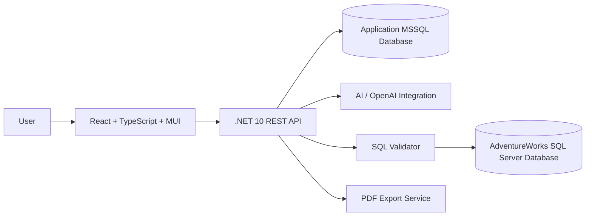

# Architecture

## Purpose

This document describes the initial architecture assumptions for AdventureWorksAIWorkspace.

## High-Level Architecture

## Main Components

### Frontend

Responsible for:

- Main dashboard layout.
- Left report management sidebar.
- Right AI chat sidebar.
- Center report workspace.
- Chart rendering with MUI Charts.
- Report metadata interactions.
- Export actions.

### .NET REST API

Responsible for:

- User authentication and authorization.
- Report persistence.
- AI request orchestration.
- SQL generation workflow.
- SQL validation.
- Query execution.
- Chart configuration generation.
- PDF export orchestration.

### Application Database

Stores application-owned data:

- Users.
- Reports.
- Report conversations.
- Generated SQL metadata.
- Chart configurations.
- Tags.
- Favorites.
- Export history.

### AdventureWorks Database

Acts as the analytical business data source.

This database should be separate from the application database and accessed through read-only credentials.

### AI Integration

Responsible for:

- Understanding user prompts.
- Generating SQL.
- Suggesting chart types.
- Creating business summaries.
- Supporting follow-up report refinement.

### SQL Validator

Responsible for:

- Blocking destructive SQL.
- Allowing only safe read-only queries.
- Limiting risky SQL patterns.
- Preparing future query safety rules.

## Initial Backend Module Ideas

- Authentication module.
- Reports module.
- Conversations module.
- AI orchestration module.
- SQL generation module.
- SQL validation module.
- Query execution module.
- Visualization planning module.
- Export module.

## Initial Frontend Module Ideas

- App shell layout.
- Report sidebar.
- AI chat sidebar.
- Report workspace.
- Chart renderer.
- Table renderer.
- KPI cards.
- Report metadata controls.
- Export controls.

## Key Architectural Assumptions

- Application data and AdventureWorks data should be stored in separate databases.
- The backend should never expose direct database access to the frontend.
- AI-generated SQL should always pass through validation before execution.
- Reports should store enough metadata to be reopened without regenerating everything.
- SQL query reuse may reduce AI token usage.
