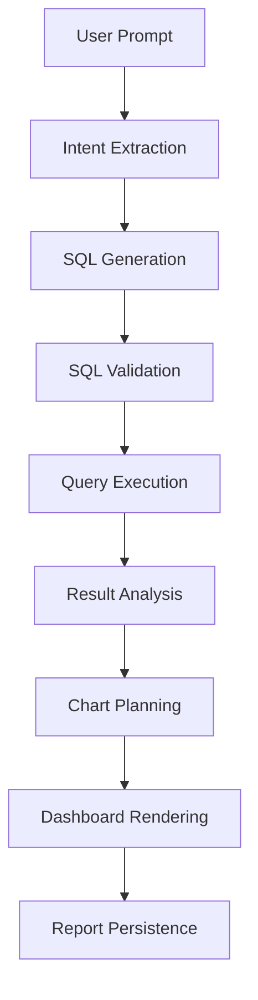

# AI SQL Workflow

## Purpose

This document describes the planned workflow for transforming natural language business questions into safe SQL queries and visual dashboard reports.

## High-Level Workflow

## Step 1: User Prompt

The user enters a natural language question.

Example:

> Show me a sales report for product X in Q3 of year Y in region Z.

## Step 2: Intent Extraction

The AI or backend should identify:

- Business entity.
- Metric.
- Time range.
- Region or territory.
- Product or category.
- Aggregation level.
- Required dimensions.
- Expected report type.

## Step 3: SQL Generation

The AI generates a SQL query targeting AdventureWorks.

The system should prefer SQL that is:

- Read-only.
- Understandable.
- Limited in result size.
- Aligned with the user's business intent.

## Step 4: SQL Validation

Before execution, the SQL must be validated.

Validation should block or reject:

- INSERT
- UPDATE
- DELETE
- DROP
- ALTER
- TRUNCATE
- EXEC
- MERGE
- CREATE
- GRANT
- REVOKE

Future validation may include:

- Query timeout checks.
- Result size limits.
- Table allowlist.
- Column allowlist.
- SQL parser-based validation.

## Step 5: Query Execution

The backend executes validated SQL against AdventureWorks using read-only credentials.

## Step 6: Result Analysis

The system examines the result shape:

- Number of rows.
- Number of columns.
- Numeric fields.
- Date/time fields.
- Categorical fields.
- Aggregated values.

## Step 7: Chart Planning

The system generates chart configuration.

Examples:

- Time series data should likely use a line chart.
- Category comparison should likely use a bar chart.
- Proportions may use a pie chart.
- Single metrics may use KPI cards.
- Detailed rows may use tables.

## Step 8: Dashboard Rendering

The frontend renders:

- Charts.
- Tables.
- KPI cards.
- AI summary.
- SQL explanation if enabled.

## Step 9: Report Persistence

The system saves:

- Original prompt.
- Generated SQL.
- Validation metadata.
- Chart definitions.
- AI summary.
- Conversation messages.
- Report metadata.

## Token Usage Optimization Ideas

- Store reusable SQL templates.
- Store generated SQL and result metadata.
- Summarize previous report context instead of resending full conversations.
- Use compact schema descriptions.
- Avoid sending unnecessary raw data to AI.

## Open Questions

- Should AI receive full AdventureWorks schema or a curated semantic layer?
- Should users be allowed to edit generated SQL manually?
- Should SQL be visible by default or hidden behind advanced options?
- How much result data should be sent back to AI for summary generation?
