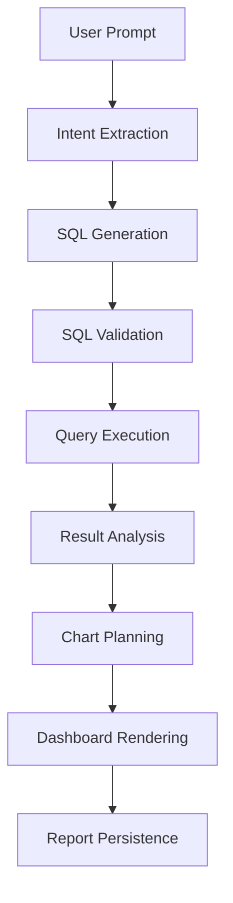
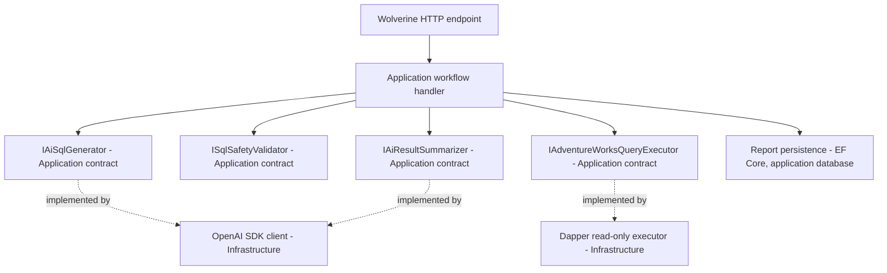

# AI SQL Workflow

## Purpose

This document describes the planned workflow for transforming natural language business questions into safe SQL queries and visual dashboard reports.

## High-Level Workflow

## Report Chat Workflow

The chat experience should be modeled as a report-centered workflow rather than a standalone chat transcript.

Recommended endpoint shape:

- `POST /api/reports` creates a new report from the first user message.
- `POST /api/reports/{reportId}/messages` appends a follow-up user message to an existing report conversation.
- `GET /api/reports` returns report metadata for the sidebar.
- `GET /api/reports/{reportId}` returns report metadata, conversation history, generated SQL metadata, and the latest renderable result metadata.

The existing `POST /api/reports/generate` endpoint can remain a temporary vertical slice for AI SQL generation and execution. The persisted MVP flow should evolve it into report creation and report-message endpoints so chat history and generated SQL are saved transactionally.

For a new report, the backend should:

1. Create a `Report` record owned by the authenticated user.
2. Create a `ReportConversation` record for the report.
3. Save the user's first `ReportMessage`.
4. Generate SQL through the AI workflow.
5. Save the generated SQL attempt and token usage.
6. Validate the SQL and update the generated SQL validation fields.
7. Execute the SQL only when validation succeeds.
8. Save execution metadata and the assistant response message.
9. Update the report title, status, and `UpdatedAt`.
10. Return the report, latest assistant message, SQL metadata, and result metadata.

For a follow-up message, the backend should:

1. Verify the authenticated user owns the target report.
2. Save the new user message in the report conversation.
3. Build AI context from the report metadata, recent messages, and relevant generated SQL artifacts.
4. Generate, validate, execute, and persist a new SQL attempt when the follow-up requires data.
5. Save the assistant message.
6. Update the report `UpdatedAt` and status.

## Step 1: User Prompt

The user enters a natural language question.

Example:

> Show me a sales report for product X in Q3 of year Y in region Z.

## Step 2: Intent Extraction

The AI or backend should identify:

- Business entity.
- Metric.
- Time range.
- Region or territory.
- Product or category.
- Aggregation level.
- Required dimensions.
- Expected report type.

## Step 3: SQL Generation

The AI generates a SQL query targeting AdventureWorks.

The system should prefer SQL that is:

- Read-only.
- Understandable.
- Limited in result size.
- Aligned with the user's business intent.

## Step 4: SQL Validation

Before execution, the SQL must be validated.

Validation should block or reject:

- INSERT
- UPDATE
- DELETE
- DROP
- ALTER
- TRUNCATE
- EXEC
- MERGE
- CREATE
- GRANT
- REVOKE

Future validation may include:

- Query timeout checks.
- Result size limits.
- Table allowlist.
- Column allowlist.
- SQL parser-based validation.

## Step 5: Query Execution

The backend executes validated SQL against AdventureWorks using read-only credentials.

## Step 6: Result Analysis

The system examines the result shape:

- Number of rows.
- Number of columns.
- Numeric fields.
- Date/time fields.
- Categorical fields.
- Aggregated values.

## Step 7: Chart Planning

The system generates chart configuration.

Examples:

- Time series data should likely use a line chart.
- Category comparison should likely use a bar chart.
- Proportions may use a pie chart.
- Single metrics may use KPI cards.
- Detailed rows may use tables.

## Step 8: Dashboard Rendering

The frontend renders:

- Charts.
- Tables.
- KPI cards.
- AI summary.
- SQL explanation if enabled.

## Step 9: Report Persistence

The system saves:

- Original prompt.
- Generated SQL.
- Validation metadata.
- Execution metadata.
- Token usage metadata.
- Chart definitions.
- AI summary.
- Conversation messages.
- Report metadata.

## Backend Component Mapping

This section maps the workflow steps onto the planned backend components. It follows the existing CQRS layering: use cases and orchestration live in the Application project behind interfaces, and external integrations live in the Infrastructure project behind those interfaces.

| Workflow step | Application contract | Infrastructure implementation |
| --- | --- | --- |
| SQL generation (Steps 2-3) | `IAiSqlGenerator` (working name) | OpenAI .NET SDK client behind a typed `HttpClient` |
| SQL validation (Step 4) | `ISqlSafetyValidator` (working name) | SQL safety rules; no external dependency |
| Query execution (Step 5) | `IAdventureWorksQueryExecutor` (working name) | Dapper over a read-only `SqlConnection` |
| Result analysis and summary (Steps 6, 8) | `IAiResultSummarizer` (working name) | OpenAI .NET SDK client behind a typed `HttpClient` |
| Report persistence (Step 9) | Application use case | EF Core against the application database |

Notes:

- Interface names above are working names for documentation only. Final names are an implementation decision.
- The OpenAI client uses the official `OpenAI` .NET SDK, registered through a typed `HttpClient`, with model configuration bound through the options pattern and the API key supplied through User Secrets or environment variables. See the technical decision "Use the official OpenAI .NET SDK behind an Application abstraction for AI features".
- The AdventureWorks executor uses Dapper with read-only credentials, command timeouts, and result-size limits. See the technical decision "Use EF Core for application persistence and Dapper for AdventureWorks query execution".
- The AI client and the AdventureWorks executor are never called directly from the Api layer; they are always reached through Application handlers.

## Safety Boundary

The model output is untrusted across the whole workflow:

- Generated SQL must always pass `ISqlSafetyValidator` before reaching the executor, regardless of how confident the model appears.
- The executor connects to AdventureWorks with read-only credentials, so even a validation gap cannot mutate analytical data.
- Prompts must be constructed to limit prompt-injection risk and to avoid sending unnecessary sensitive schema or data to the model.
- AI requests, generated SQL, validation outcomes, and execution metadata should be logged for auditing.

## Token Usage Optimization Ideas

- Store reusable SQL templates.
- Store generated SQL and result metadata.
- Summarize previous report context instead of resending full conversations.
- Use compact schema descriptions.
- Avoid sending unnecessary raw data to AI.

## Open Questions

- Should AI receive full AdventureWorks schema or a curated semantic layer?
- Should users be allowed to edit generated SQL manually?
- Should SQL be visible by default or hidden behind advanced options?
- How much result data should be sent back to AI for summary generation?
